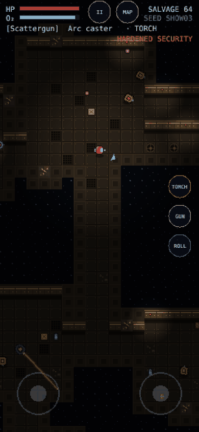
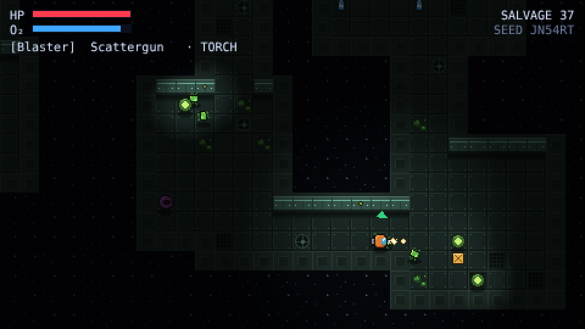
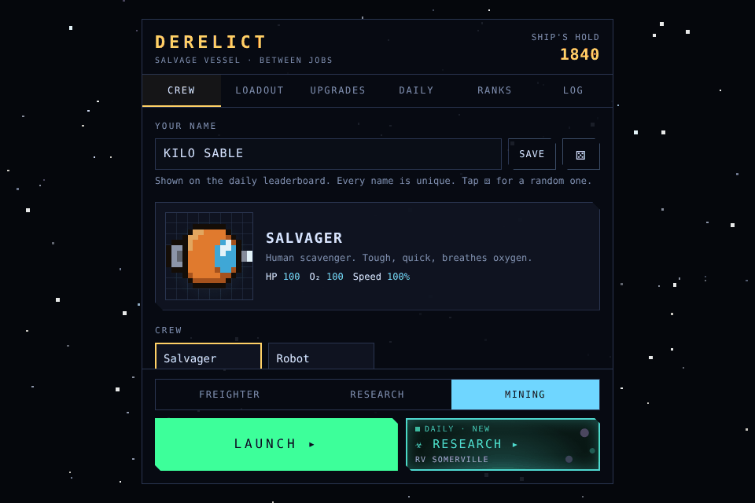

# Derelict

[](https://github.com/ShanujPatel/derelict/actions/workflows/ci.yml)

A real-time, top-down sci-fi roguelike that runs in the browser. Board abandoned ships, salvage what you can, and get out before your oxygen runs dry.

**▶ [Play in your browser](https://ShanujPatel.github.io/derelict/)** · [Daily Derelict](https://ShanujPatel.github.io/derelict/?daily)


## How to play

| Action | Control |
|---|---|
| Move | WASD / arrow keys |
| Aim and fire | Mouse / left click (hold) |
| Swap gun | Q, 1 / 2, or mouse wheel |
| Tool (torch, hacking or grav) | F or right click |
| Pause | Esc or P |
| Mute | M |

**On a phone or tablet:** left thumb moves, right thumb aims and fires. The **GUN** and tool buttons sit on the right, and **II** at the top pauses. Works in portrait and landscape.

**Sound:** every sound effect and the music are synthesised in the browser with Web Audio. There are no audio files. Each ship type has its own theme, and drums fade in when things are hunting you. Volume sliders, screen shake and flashes are under **Log → Settings**.



Find salvage crates and O₂ canisters, fight or avoid what lives aboard, and reach the green extraction pad. Salvage only counts if you extract. The green arrow round your suit points to the exit.

**Two kinds of wreck:**

- **Corporate freighters** are guarded by patrol drones and wall turrets.
- **Research vessels** are overrun by the Bloom: fast crawlers, acid-spitting pods and egg sacs that keep hatching. Find the right crew log to unlock them.

**Gravecutters:** about a minute into every run, a rival salvage crew docks behind you. Raiders strip loose salvage and shoot in bursts; the brute's riot shield blocks shots from the front, so flank it, stun it or use the railgun. Take them down to get your loot back.

**Tools:** the cutting torch opens cracked walls for shortcuts. The hacking tool turns turrets to your side and opens locked caches. The grav tool fires a cone-shaped push that shoves and stuns enemies and swats incoming shots aside.

**Crew logs:** every ship hides one data log. Collect them to piece together what happened to the Halcyon Drift and the Lacuna. You keep logs even if you die.



**Between runs** you're back on your own ship. Spend banked salvage on:

- **Crew:** unlock the armoured Robot, which runs on battery instead of oxygen.
- **Systems:** hull plating, life support and servo boot upgrades.
- **Armoury:** the Railgun, which pierces a whole line of enemies, and the Hacking tool.
- **Perks:** Scavenger, Cold cutter, Scrapper or Second wind, one per run.
- **Cosmetics:** suit, visor, chassis and optics colours.

Progress saves in your browser. Use **Log → Copy save code** to move it to another device.



**Daily Derelict:** one ship a day, the same for everyone. Extract to post your salvage to the online leaderboard (DAILY tab); only your best run counts. Setting up your own board takes about 10 minutes: see [docs/LEADERBOARD.md](docs/LEADERBOARD.md).

**Seeds:** every ship comes from a seed shown in the top-right corner. Share a ship with `?seed=YOURSEED` (add `&ship=research` for a research vessel), or play today's shared ship with `?daily`.

## Running locally

Requires Node.js 20 or later.

```bash
npm install
npm run dev        # start the dev server
npm test           # run unit tests
npm run typecheck  # TypeScript checks
npm run build      # production build in dist/
```

## How it's built

| Area | Choice |
|---|---|
| Language | TypeScript (strict) |
| Engine | [Phaser 3](https://phaser.io) |
| Build | Vite |
| Tests | Vitest |
| CI/CD | GitHub Actions → GitHub Pages |
| Leaderboard | Supabase (Postgres functions + row level security), called with plain `fetch` |

```
src/
  core/      Pure game logic: RNG, seeds, deck generator (per ship type), tile display
             rules, pathfinding, oxygen, weapons, codex, rivals, leaderboard rules,
             progression (shop, saves, export codes), virtual-stick maths, screen sizing.
             No Phaser imports, so it's fully unit-tested.
             Sound effect and music definitions (sfx, music) live here too.
  audio/     Web Audio engine: synth voices, mixer, generative music player.
  scenes/    Phaser scenes: Boot (builds textures), Hub, Game and Pause, plus enemy AI.
  hub/       Between-runs screens as an HTML/CSS overlay.
  net/       Leaderboard client (Supabase REST).
  ui/        Touch controls (twin virtual sticks).
  art/       Original pixel art defined in code: no binary assets.
tests/       Vitest unit tests for core/ and net/, plus the leaderboard SQL run in PGlite.
docs/        Game design document, leaderboard schema and setup guide.
```

**Procedural generation.** Each deck is built from a seed with a deterministic RNG (mulberry32), so the same seed always gives the same ship. Rooms are placed and joined to their nearest neighbour with two-tile corridors, and a few extra loops are added. Extraction goes in the room furthest from the start on foot. Thin walls that would save a long walk become weak walls you can cut with the torch. Each ship type has its own spawn table: freighters mount turrets against walls, research vessels breed aliens. The data log always goes in the furthest 40% of the ship. Tests check these rules across 100 seeds of each ship type: every floor tile is reachable, enemies never spawn near the start, and cutting weak walls only ever adds shortcuts.

## Roadmap

See the full [game design document](docs/GDD.md).

- [x] **v0.1** Salvager, freighter decks, drones, two guns, cutting torch, oxygen, seeded runs, CI/CD
- [x] **v0.1.1** New pixel art, lighting, touch controls, portrait and landscape mobile support
- [x] **v0.2** Robot character, customisation, hub with permanent unlocks, railgun, perks
- [x] **v0.3** Research vessels, alien enemies, turrets, hacking tool, codex chapter 1
- [x] **v0.4** Online daily leaderboard, Gravecutter rivals, grav tool
- [x] **v0.5** Synthesised sound and music, pause menu, settings, hit-pause, death and extraction moments
- [ ] **Later** Bosses, more codex chapters, more ship types

## Licence

[MIT](LICENSE)
