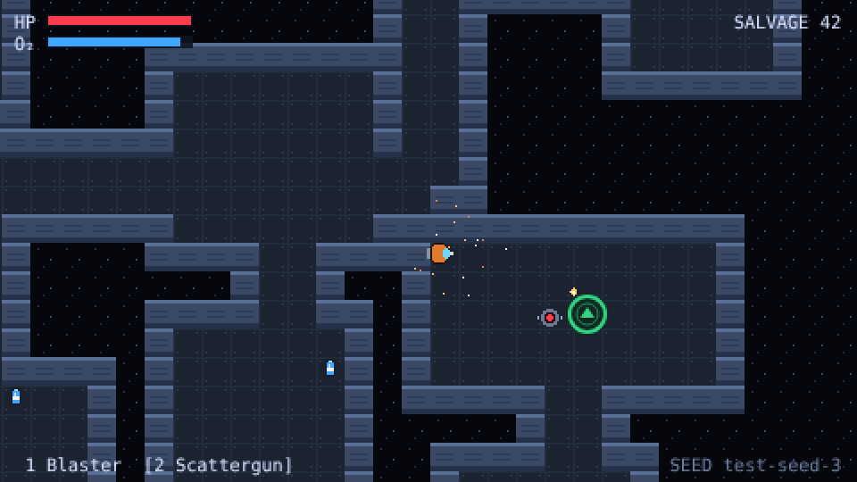

# Derelict

[](https://github.com/YOUR-USERNAME/derelict/actions/workflows/ci.yml)

A real-time, top-down sci-fi roguelike that runs in the browser. Board abandoned ships, salvage what you can, and get out before your oxygen runs dry.

**▶ [Play in your browser](https://ShanujPatel.github.io/derelict/)** · [Daily Derelict](https://ShanujPatel.github.io/derelict/?daily)



## How to play

| Action | Control |
|---|---|
| Move | WASD / arrow keys |
| Aim and fire | Mouse / left click (hold) |
| Swap gun | Q, 1 / 2, or mouse wheel |
| Cutting torch | F or right click, facing a cracked wall |

Find salvage crates and O₂ canisters, avoid or destroy the patrol drones, and reach the green extraction pad. Salvage only counts if you extract. The green arrow round your suit points to the exit.

**Seeds:** every ship comes from a seed shown in the bottom-right corner. Share a ship with `?seed=YOURSEED`, or play today's shared ship with `?daily`.

## Running locally

Requires Node.js 20 or later.

```bash
npm install
npm run dev        # start the dev server
npm test           # run unit tests
npm run typecheck  # TypeScript checks
npm run build      # production build in dist/
```

## How it's built

| Area | Choice |
|---|---|
| Language | TypeScript (strict) |
| Engine | [Phaser 3](https://phaser.io) |
| Build | Vite |
| Tests | Vitest |
| CI/CD | GitHub Actions → GitHub Pages |

```
src/
  core/      Pure game logic: RNG, seeds, deck generator, pathing, oxygen, weapons.
             No Phaser imports, so it's fully unit-tested.
  scenes/    Phaser scenes: Boot (builds textures) and Game.
  art/       Placeholder pixel art defined in code.
tests/       Vitest unit tests for everything in core/.
docs/        Game design document.
```

**Procedural generation.** Each deck is built from a seed with a deterministic RNG (mulberry32), so the same seed always gives the same ship. Rooms are placed and joined to their nearest neighbour with two-tile corridors, and a few extra loops are added. Extraction goes in the room furthest from the start on foot. Thin walls that would save a long walk become weak walls you can cut with the torch. Tests check these rules across 150 seeds: every floor tile is reachable, drones never spawn near the start, and cutting weak walls only ever adds shortcuts.

## Roadmap

See the full [game design document](docs/GDD.md).

- [x] **v0.1** Salvager, freighter decks, drones, two guns, cutting torch, oxygen, seeded runs, CI/CD
- [ ] **v0.2** Robot character, customisation, hub with permanent unlocks
- [ ] **v0.3** Research vessels, alien enemies, codex chapter 1, touch controls, hacking tool
- [ ] **v0.4** Daily leaderboard, rival salvagers, grav tool, railgun
- [ ] **Later** Bosses, more codex chapters, more ship types

## Licence

[MIT](LICENSE)
